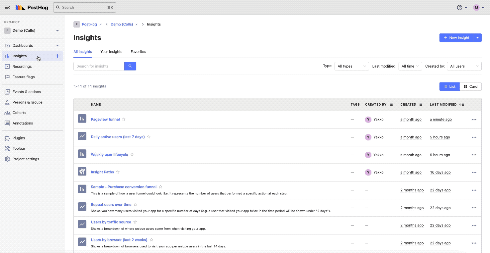

# Posthog CI/CD pipeline

Deploy Posthog server with CI/CD on Elestio

 
 

# Important

once deployed, you will receive a verification email. Click on the link to activate your account.

# Once deployed ...

You can can open Posthog here:

    URL: https://[CI_CD_DOMAIN]
    Login: [ADMIN_EMAIL]
    password: [ADMIN_PASSWORD]

You can open pgAdmin web UI here:

    URL: https://[CI_CD_DOMAIN]:6443
    email: [ADMIN_EMAIL]
    password: [ADMIN_PASSWORD]
